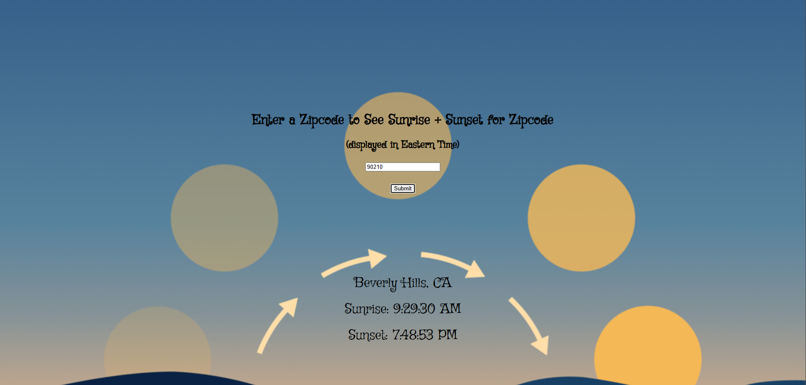

# Sunrise Sunset API

Link to project: (https://sunrisesunsetcycle.netlify.app/)

## How It's Made:
Tech used: HTML, CSS, JS

An application that utilizes chained fetch requests to show today's sunrise and sunset times for the zipcode that the user types in. 

Grabs the latitude and longitude of the user typed zipcode from thehttps://api.zippopotam.us/ API, and plugs that information into the https://api.sunrise-sunset.org API to pull the current day's sunrise and sunset time for the specified location in Eastern Time. 

## Lessons Learned

This application taught me the value of simplicity - a small amount of code can still produce a purposeful application.
